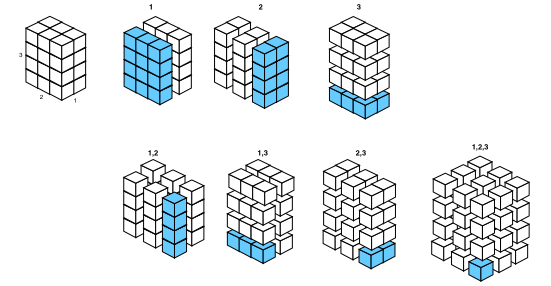
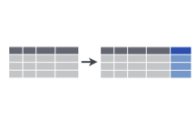
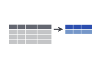

<style>
.reveal section code {
  font-size: 1em;
}
</style>

dplyr
========================================================
author: Etienne Low-Décarie
date: October 27 2015
transition: fade

dplyr and plyr
===

 

About you
===

- do you use `plyr`/`dplyr` already?
- do you use `for` loops?
  - in which you select part of your data in each loop `[,]`?
- do you use `apply`, `lapply`, `sapply`?
- do you use pivot tables?


Split-Apply-Combine
===

- Equivalent
  - SQL GROUP BY
  - Pivot Tables (Excel, SPSS, …)
  


***
  
- Split
  - Define a subset of your data
- Apply
  - Do anything to this subset 
    - calculation, modeling, simulations, plotting
- Combine

- Repeat this for all subsets
  - collect the results
  

History and use
===

- plyr
  - any input, any output
      - to load a list of files
      - to produce plots
  - slow and complicated

***

- dplyr
  - data.frame in/data.frame out
  - faster
  - Details:
   - introducing chaining to R
   - remote database integration
    
    
Conflict between plyr and dplyr
===

`plyr` and `dplyr` do not play nice together  
Always load `dplyr` last  
Be careful of packages that load `plyr` 


```r
require(plyr)
require(dplyr)
```

you can also use `dplyr:::` to ensure functions are called from dplyr  

[issue](https://github.com/hadley/dplyr/issues/347)

dplyr    
===

Vignette
[https://cran.rstudio.com/web/packages/dplyr/vignettes/introduction.html](https://cran.rstudio.com/web/packages/dplyr/vignettes/introduction.html)

Cheatsheet
[https://www.rstudio.com/wp-content/uploads/2015/02/data-wrangling-cheatsheet.pdf](https://www.rstudio.com/wp-content/uploads/2015/02/data-wrangling-cheatsheet.pdf)

Grouping
===

**Split** -Apply-Combine

- `group_by()`

Group data
===


```r
if(!require(dplyr)){install.packages("dplyr")}
require(dplyr)
CO2_by_Plant_Type_Treatment <- group_by(CO2,
                                        Plant,
                                        Type,
                                        Treatment)
```


group data
===

`group_by` implies `tbl_df`
`tbl_df` wraps a `data.frame`

```r
print(CO2_by_Plant_Type_Treatment)
```

```
Source: local data frame [84 x 5]
Groups: Plant, Type, Treatment [12]

    Plant   Type  Treatment  conc uptake
   (fctr) (fctr)     (fctr) (dbl)  (dbl)
1     Qn1 Quebec nonchilled    95   16.0
2     Qn1 Quebec nonchilled   175   30.4
3     Qn1 Quebec nonchilled   250   34.8
4     Qn1 Quebec nonchilled   350   37.2
5     Qn1 Quebec nonchilled   500   35.3
6     Qn1 Quebec nonchilled   675   39.2
7     Qn1 Quebec nonchilled  1000   39.7
8     Qn2 Quebec nonchilled    95   13.6
9     Qn2 Quebec nonchilled   175   27.3
10    Qn2 Quebec nonchilled   250   37.1
..    ...    ...        ...   ...    ...
```

```r
class(CO2_by_Plant_Type_Treatment)
```

```
[1] "grouped_df" "tbl_df"     "tbl"        "data.frame"
```

group data
===

**Caution when working with functions that expect a `data.frame`**


```r
class(CO2_by_Plant_Type_Treatment)
```

```
[1] "grouped_df" "tbl_df"     "tbl"        "data.frame"
```

```r
head(as.data.frame(CO2_by_Plant_Type_Treatment))
```

```
  Plant   Type  Treatment conc uptake
1   Qn1 Quebec nonchilled   95   16.0
2   Qn1 Quebec nonchilled  175   30.4
3   Qn1 Quebec nonchilled  250   34.8
4   Qn1 Quebec nonchilled  350   37.2
5   Qn1 Quebec nonchilled  500   35.3
6   Qn1 Quebec nonchilled  675   39.2
```


Apply verbes
===
class: small-code

Split-**Apply-Combine**

- `mutate`


 

- `summarise`


 


Summarize grouped data
===
class: small-code

Summarize by extracting maximum uptake per plant


```r
CO2_max_per_plant <- dplyr:::summarise(CO2_by_Plant_Type_Treatment,
                               max_uptake=max(uptake))
print(CO2_max_per_plant)
```

```
Source: local data frame [12 x 4]
Groups: Plant, Type [?]

    Plant        Type  Treatment max_uptake
   (fctr)      (fctr)     (fctr)      (dbl)
1     Qn1      Quebec nonchilled       39.7
2     Qn2      Quebec nonchilled       44.3
3     Qn3      Quebec nonchilled       45.5
4     Qc1      Quebec    chilled       38.7
5     Qc3      Quebec    chilled       41.4
6     Qc2      Quebec    chilled       42.4
7     Mn3 Mississippi nonchilled       28.5
8     Mn2 Mississippi nonchilled       32.4
9     Mn1 Mississippi nonchilled       35.5
10    Mc2 Mississippi    chilled       14.4
11    Mc3 Mississippi    chilled       19.9
12    Mc1 Mississippi    chilled       22.2
```


Plot summarized data
===
left: 75%


 


```
processing file: dplyr.Rpres
Loading required package: png
Loading required package: grid
Loading required package: plyr
Loading required package: dplyr

Attaching package: 'dplyr'

The following objects are masked from 'package:plyr':

    arrange, count, desc, failwith, id, mutate, rename, summarise,
    summarize

The following objects are masked from 'package:stats':

    filter, lag

The following objects are masked from 'package:base':

    intersect, setdiff, setequal, union

Loading required package: ggplot2
Quitting from lines 192-205 (dplyr.Rpres) 
Error: Unknown parameters: fun.y
In addition: Warning messages:
1: package 'ggplot2' was built under R version 3.2.3 
2: `stat` is deprecated 
3: `position` is deprecated 
Execution halted
```
