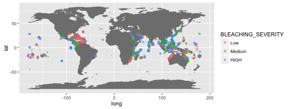
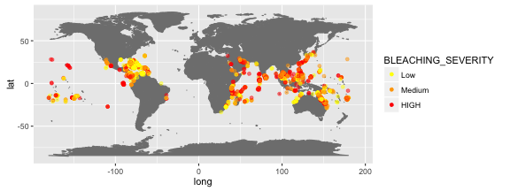
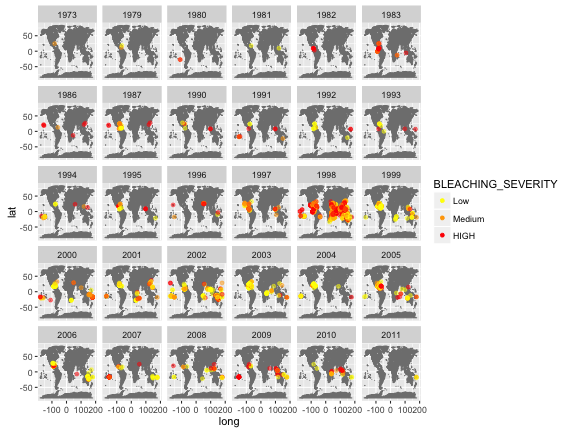

<style>
.small-code pre code {
  font-size: 1em;
}
</style>


ggmap
========================================================
author: Etienne Low-Décarie
date: September 25, 2015


Creating maps
===
class: small-code


```r
if(!require(ggmap)) {install.packages("ggmap")}
require(ggmap)
if(!require(maptools)) {install.packages("maptools")}
require(maptools)
```

Basic world map
===
class: small-code


```r
map <- ggplot()+borders("world", 
                        colour="gray50",
                        fill="gray50")
print(map)
```

 

Pretty world map
===

bounding box lowerleftlon, lowerleftlat, upperrightlon, upperrightlat (a little glitchy for google maps)


```r
myLocation <- with(coord, c(min(LON),
                            min(LAT), 
                            max(LON), 
                            max(LAT)))
```


```r
myLocation <- c(-179,-89,179,89)
myMap <- get_map(location=myLocation, 
                 source="stamen", 
                 maptype="watercolor",
                 crop=FALSE) 

myMap <- ggmap(myMap)
```


Load geo-referenced coral bleaching data
===

Coral bleaching data from ReefBase http://www.reefbase.org

```r
coord <- read.csv("./Data/CoralBleaching_cleaned.csv")
```

Extract bleaching events


```r
coord <- coord[coord$BLEACHING_SEVERITY %in% c("Low","Medium","HIGH"),]
coord$BLEACHING_SEVERITY <- factor(coord$BLEACHING_SEVERITY, levels=levels(coord$BLEACHING_SEVERITY)[c(2,3,1)])
```


Add the data to the map
===


```r
map <- map+geom_point(data=coord,aes(x=LON,
                                     y=LAT,
                                     colour=BLEACHING_SEVERITY),
                      alpha=0.5)
print(map)
```

 

Fine tuning: Scales
===


```r
map <- map+
  scale_colour_manual(values = c("Low"="yellow",
                                 "Medium"="orange",
                                 "HIGH"="red"))+
  guides(colour = guide_legend(override.aes = list(alpha = 1))) #+
  #facet_grid(YEAR~.)

print(map)
```

 

Fine tuning: Facets
===


```r
print(map+facet_wrap(~YEAR))
```

 
