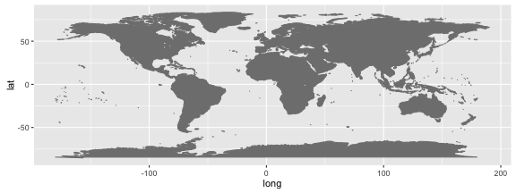

<style>
.small-code pre code {
  font-size: 1em;
}
</style>


ggmap
========================================================
author: Etienne Low-Décarie
date: October 27 2015


Creating maps
===
class: small-code


```r
if(!require(ggmap)) {install.packages("ggmap")}
require(ggmap)
if(!require(maptools)) {install.packages("maptools")}
require(maptools)
```

Basic world map
===
class: small-code


```r
map <- ggplot()+borders("world", 
                        colour="gray50",
                        fill="gray50")
print(map)
```

 

Resource
===

Cheatsheet:


Pretty world map
===

bounding box lowerleftlon, lowerleftlat, upperrightlon, upperrightlat (a little glitchy for google maps)


```r
myLocation <- with(coord, c(min(LON),
                            min(LAT), 
                            max(LON), 
                            max(LAT)))
```


```
Error in download.file(url, destfile = tmp, quiet = !messaging, mode = "wb") : 
  cannot open URL 'http://tile.stamen.com/watercolor/2/0/-2.jpg'
```
