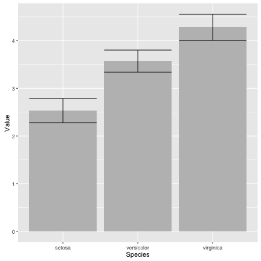
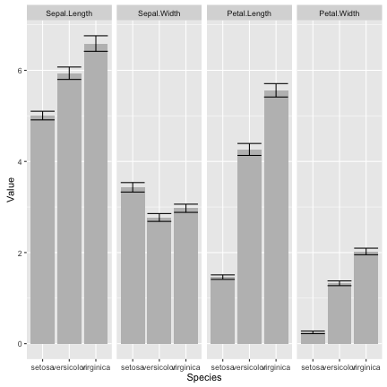
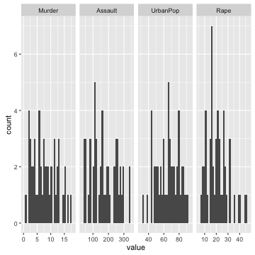
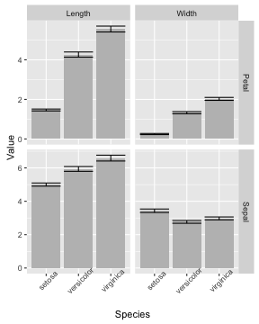

<style>
.reveal section code {
  font-size: 1em;
}
</style>


tidyr
========================================================
author: Etienne Low-Décarie
date: September 24, 2015

Long vs wide data
===

Wide

 

Long

 


Tidy vs untidy data
===

Tidy data

1. Each variable forms a column.
2. Each observation forms a row.
3. Each type of observational unit forms a table.

Messy data
- Anything else

Wickham, H. (2014). Tidy Data. J. Stat. Softw., 59, 1–2.


History
===

- reshape and reshape2  
  - melt and cast
  - aggregate: summary calculations
- tidyr
  - only data frames
  - simple unique use verbs
  - no summarising/aggregation


Going from wide to long
===
class: small-code

`gather`


```r
long_data<-gather(wide_data,
                  key,
                  value,
                  selected_columns)
```

`melt` in `reshape`(`2`)

Ways to select columns
===

- Use bare variable names.

```r
long_iris<-gather(iris,"Measurement",
                  "Value",
                  Sepal.Length,
                  Sepal.Width,
                  Petal.Length,
                  Petal.Width)

grid.table(head(long_iris))
```

 

Ways to select columns
===

- Select all variables between `x` and `z` with `x:z`

```r
long_iris<-gather(iris,"Measurement",
                  "Value",
                  Sepal.Length:Petal.Width)
```


Ways to select columns
===

- Exclude y with `-y`.

```r
long_iris<-gather(iris,"Measurement",
                  "Value",
                  -Species)
```


Exercise 1
===

- basic challenge
  - make the `data(BCI)` long (`require(vegan)`)
  - make the data in `data(simesants)` long (`require(simesants)`)
  
<div class="centered">

<script src="countdown.js" type="text/javascript"></script>
<script type="application/javascript">
var myCountdown2 = new Countdown({
    							time: 300, 
									width:150, 
									height:80, 
									rangeHi:"minute"	// <- no comma on last item!
									});

</script>

</div>

- extra challenge:  
use `gather` to produce a data.frame from a jpeg  
that can be plotted using ggplot
  - download
  - plot the red channel of the UQAM logo
  
Exercise 1
===


```r
image_data <- readPNG("./Data/logo_uqam.png")
red <- as.data.frame(image_data[,,1])
red$y <- as.numeric(rownames(red))
red_long <- gather(red,"x","value", -y)
red_long$x <- as.numeric(gsub("V","", red_long$x))
qplot(data=red_long,
      x=x,
      y=-y,
      fill=value,
      geom="raster")
```


Going from long to wide
===

`spread`


```r
wide_data <- spread(long_data,
                    key,
                    value)
```

(`d`/`a`)cast in `reshape`(`2`)

Going from long to wide
===


```r
wide_iris <- spread(long_iris,
                    Measurement,
                    Value)
```

Going from long to wide
===
Each case must have a label!


```r
iris$Specimen <- 1:nrow(iris)

long_iris<-gather(iris,"Measurement",
                  "Value",
                  Sepal.Length:Petal.Width)

wide_iris <- spread(long_iris,
                    Measurement,
                    Value)
```


Exercise 2
===

- create a data.frame of `data(barley)` from `require(lattice)`  
in which each `variety` is in a seperate column

<div class="centered">

<script src="countdown.js" type="text/javascript"></script>
<script type="application/javascript">
var myCountdown2 = new Countdown({
    							time: 300, 
									width:150, 
									height:80, 
									rangeHi:"minute"	// <- no comma on last item!
									});

</script>

</div>


Exercise 2
===


```r
barley_wide <- spread(barley,
                    variety,
                    yield)
```


Going long for faceting by variable
===
left: 70%

Excellent for exploratory analysis


```r
require(ggplot2)
p <- qplot(data=long_iris,
           x=Species,
           y=Value,
           geom="bar",
           stat="summary",
           fun.y="mean",
           fill=I("grey"))+
  stat_summary(fun.data = "mean_cl_boot", geom="errorbar")
```

***

 

Going long for faceting by variable
===


```r
print(p+facet_grid(.~Measurement))
```

 


Going long for faceting by variable
===


```r
print(p+facet_grid(Measurement~., scale="free"))
```

 

Exercise 3
===

-using `gather` and `facets`
- plot a histogram of each of the variables in `USArrests`
- plot the time series for each of the variables in the `airquality` dataset

<div class="centered">

<script src="countdown.js" type="text/javascript"></script>
<script type="application/javascript">
var myCountdown1 = new Countdown({
    							time: 300, 
									width:150, 
									height:80, 
									rangeHi:"minute"	// <- no comma on last item!
									});

</script>

</div>

Exercise 3
===

```r
USArrests_long <- gather(USArrests,
                         crime_var,
                         value)
p <- qplot(data=USArrests_long,
           x=value)+
  facet_grid(.~crime_var, scale="free")
print(p)
```

 

Seperate string variable
===


```r
seperated_iris <- separate(long_iris,
                      Measurement, 
                      c("Organ", "Dimension"))
```

Seperate string variable and spreading
===


```r
wide_iris <- spread(seperated_iris,
                    Dimension,
                    Value)
```

Plot seperated iris
===


```r
p <- qplot(data=seperated_iris,
           x=Species,
           y=Value,
           geom="bar",
           stat="summary",
           fun.y="mean",
           fill=I("grey"))+
  stat_summary(fun.data = "mean_cl_boot", 
               geom="errorbar")+
  facet_grid(Organ~Dimension,
             scale="free")
```

***

 
