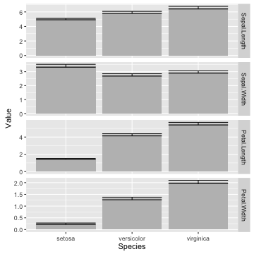
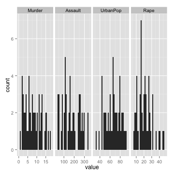

<style>
.reveal section code {
  font-size: 1em;
}
</style>


tidyr
========================================================
author: Etienne Low-Décarie
date: October 27 2015
transition: zoom

Long vs wide data
===

Wide

 

Long

 


Tidy vs untidy data
===

Tidy data

1. Each variable forms a column.
2. Each observation forms a row.
3. Each type of observational unit forms a table.

Messy data
- Anything else

[Wickham, H. (2014). Tidy Data. J. Stat. Softw., 59, 1–2.](http://www.jstatsoft.org/article/view/v059i10/v59i10.pdf)


History
===

- `reshape` and `reshape2` 
  - melt and cast
  - aggregate: summary calculations
- `tidyr`
  - only data frames
  - simple unique use verbs
  - no summarising/aggregation


Going from wide to long
===
class: small-code

`gather`


```r
long_data<-gather(wide_data,
                  key,
                  value,
                  selected_columns)
```

`melt` in `reshape`(`2`)

Ways to select columns
===

- Use bare variable names.

```r
long_iris<-gather(iris,"Measurement",
                  "Value",
                  Sepal.Length,
                  Sepal.Width,
                  Petal.Length,
                  Petal.Width)

grid.table(head(long_iris))
```

 

Ways to select columns
===

- Select all variables between `x` and `z` with `x:z`

```r
long_iris<-gather(iris,"Measurement",
                  "Value",
                  Sepal.Length:Petal.Width)
```


Ways to select columns
===

- Exclude y with `-y`.

```r
long_iris<-gather(iris,"Measurement",
                  "Value",
                  -Species)
```


Exercise 1
===

- basic challenge
  - make the `data(BCI)` long (`require(vegan)`)
  - make the data in `data(simesants)` long (`require(simesants)`)
  
<div class="centered">

<script src="countdown.js" type="text/javascript"></script>
<script type="application/javascript">
var myCountdown2 = new Countdown({
    							time: 300, 
									width:150, 
									height:80, 
									rangeHi:"minute"	// <- no comma on last item!
									});

</script>

</div>

- extra challenge:  
use `gather` to produce a data.frame from an image file
that can be plotted using ggplot
  - download and plot the red channel of the UQAM logo
  - use the `.nc` of world sea temperature file in the `Data` folder
  
Exercise 1
===


```r
require(png)
image_data <- readPNG("./Data/logo_uqam.png")
red <- as.data.frame(image_data[,,1])
red$y <- as.numeric(rownames(red))
red_long <- gather(red,"x","value", -y)
red_long$x <- as.numeric(gsub("V","", red_long$x))
qplot(data=red_long,
      x=x,
      y=-y,
      fill=value,
      geom="raster")
```

Exercise 1
===

 

Going from long to wide
===

`spread`


```r
wide_data <- spread(long_data,
                    key,
                    value)
```

(`d`/`a`)cast in `reshape`(`2`)

Going from long to wide
===


```r
wide_iris <- spread(long_iris,
                    Species,
                    Value)
```

Going from long to wide
===
Each case must have a label!


```r
iris$Specimen <- rep(1:50,3) #Assumes specimen 1 of setosa
                            #matches specimen 1 of versicolor

long_iris<-gather(iris,"Measurement",
                  "Value",
                  Sepal.Length:Petal.Width)

wide_iris <- spread(long_iris,
                    Species,
                    Value)

wide_iris
```

```
    Specimen  Measurement setosa versicolor virginica
1          1 Sepal.Length    5.1        7.0       6.3
2          1  Sepal.Width    3.5        3.2       3.3
3          1 Petal.Length    1.4        4.7       6.0
4          1  Petal.Width    0.2        1.4       2.5
5          2 Sepal.Length    4.9        6.4       5.8
6          2  Sepal.Width    3.0        3.2       2.7
7          2 Petal.Length    1.4        4.5       5.1
8          2  Petal.Width    0.2        1.5       1.9
9          3 Sepal.Length    4.7        6.9       7.1
10         3  Sepal.Width    3.2        3.1       3.0
11         3 Petal.Length    1.3        4.9       5.9
12         3  Petal.Width    0.2        1.5       2.1
13         4 Sepal.Length    4.6        5.5       6.3
14         4  Sepal.Width    3.1        2.3       2.9
15         4 Petal.Length    1.5        4.0       5.6
16         4  Petal.Width    0.2        1.3       1.8
17         5 Sepal.Length    5.0        6.5       6.5
18         5  Sepal.Width    3.6        2.8       3.0
19         5 Petal.Length    1.4        4.6       5.8
20         5  Petal.Width    0.2        1.5       2.2
21         6 Sepal.Length    5.4        5.7       7.6
22         6  Sepal.Width    3.9        2.8       3.0
23         6 Petal.Length    1.7        4.5       6.6
24         6  Petal.Width    0.4        1.3       2.1
25         7 Sepal.Length    4.6        6.3       4.9
26         7  Sepal.Width    3.4        3.3       2.5
27         7 Petal.Length    1.4        4.7       4.5
28         7  Petal.Width    0.3        1.6       1.7
29         8 Sepal.Length    5.0        4.9       7.3
30         8  Sepal.Width    3.4        2.4       2.9
31         8 Petal.Length    1.5        3.3       6.3
32         8  Petal.Width    0.2        1.0       1.8
33         9 Sepal.Length    4.4        6.6       6.7
34         9  Sepal.Width    2.9        2.9       2.5
35         9 Petal.Length    1.4        4.6       5.8
36         9  Petal.Width    0.2        1.3       1.8
37        10 Sepal.Length    4.9        5.2       7.2
38        10  Sepal.Width    3.1        2.7       3.6
39        10 Petal.Length    1.5        3.9       6.1
40        10  Petal.Width    0.1        1.4       2.5
41        11 Sepal.Length    5.4        5.0       6.5
42        11  Sepal.Width    3.7        2.0       3.2
43        11 Petal.Length    1.5        3.5       5.1
44        11  Petal.Width    0.2        1.0       2.0
45        12 Sepal.Length    4.8        5.9       6.4
46        12  Sepal.Width    3.4        3.0       2.7
47        12 Petal.Length    1.6        4.2       5.3
48        12  Petal.Width    0.2        1.5       1.9
49        13 Sepal.Length    4.8        6.0       6.8
50        13  Sepal.Width    3.0        2.2       3.0
51        13 Petal.Length    1.4        4.0       5.5
52        13  Petal.Width    0.1        1.0       2.1
53        14 Sepal.Length    4.3        6.1       5.7
54        14  Sepal.Width    3.0        2.9       2.5
55        14 Petal.Length    1.1        4.7       5.0
56        14  Petal.Width    0.1        1.4       2.0
57        15 Sepal.Length    5.8        5.6       5.8
58        15  Sepal.Width    4.0        2.9       2.8
59        15 Petal.Length    1.2        3.6       5.1
60        15  Petal.Width    0.2        1.3       2.4
61        16 Sepal.Length    5.7        6.7       6.4
62        16  Sepal.Width    4.4        3.1       3.2
63        16 Petal.Length    1.5        4.4       5.3
64        16  Petal.Width    0.4        1.4       2.3
65        17 Sepal.Length    5.4        5.6       6.5
66        17  Sepal.Width    3.9        3.0       3.0
67        17 Petal.Length    1.3        4.5       5.5
68        17  Petal.Width    0.4        1.5       1.8
69        18 Sepal.Length    5.1        5.8       7.7
70        18  Sepal.Width    3.5        2.7       3.8
71        18 Petal.Length    1.4        4.1       6.7
72        18  Petal.Width    0.3        1.0       2.2
73        19 Sepal.Length    5.7        6.2       7.7
74        19  Sepal.Width    3.8        2.2       2.6
75        19 Petal.Length    1.7        4.5       6.9
76        19  Petal.Width    0.3        1.5       2.3
77        20 Sepal.Length    5.1        5.6       6.0
78        20  Sepal.Width    3.8        2.5       2.2
79        20 Petal.Length    1.5        3.9       5.0
80        20  Petal.Width    0.3        1.1       1.5
81        21 Sepal.Length    5.4        5.9       6.9
82        21  Sepal.Width    3.4        3.2       3.2
83        21 Petal.Length    1.7        4.8       5.7
84        21  Petal.Width    0.2        1.8       2.3
85        22 Sepal.Length    5.1        6.1       5.6
86        22  Sepal.Width    3.7        2.8       2.8
87        22 Petal.Length    1.5        4.0       4.9
88        22  Petal.Width    0.4        1.3       2.0
89        23 Sepal.Length    4.6        6.3       7.7
90        23  Sepal.Width    3.6        2.5       2.8
91        23 Petal.Length    1.0        4.9       6.7
92        23  Petal.Width    0.2        1.5       2.0
93        24 Sepal.Length    5.1        6.1       6.3
94        24  Sepal.Width    3.3        2.8       2.7
95        24 Petal.Length    1.7        4.7       4.9
96        24  Petal.Width    0.5        1.2       1.8
97        25 Sepal.Length    4.8        6.4       6.7
98        25  Sepal.Width    3.4        2.9       3.3
99        25 Petal.Length    1.9        4.3       5.7
100       25  Petal.Width    0.2        1.3       2.1
101       26 Sepal.Length    5.0        6.6       7.2
102       26  Sepal.Width    3.0        3.0       3.2
103       26 Petal.Length    1.6        4.4       6.0
104       26  Petal.Width    0.2        1.4       1.8
105       27 Sepal.Length    5.0        6.8       6.2
106       27  Sepal.Width    3.4        2.8       2.8
107       27 Petal.Length    1.6        4.8       4.8
108       27  Petal.Width    0.4        1.4       1.8
109       28 Sepal.Length    5.2        6.7       6.1
110       28  Sepal.Width    3.5        3.0       3.0
111       28 Petal.Length    1.5        5.0       4.9
112       28  Petal.Width    0.2        1.7       1.8
113       29 Sepal.Length    5.2        6.0       6.4
114       29  Sepal.Width    3.4        2.9       2.8
115       29 Petal.Length    1.4        4.5       5.6
116       29  Petal.Width    0.2        1.5       2.1
117       30 Sepal.Length    4.7        5.7       7.2
118       30  Sepal.Width    3.2        2.6       3.0
119       30 Petal.Length    1.6        3.5       5.8
120       30  Petal.Width    0.2        1.0       1.6
121       31 Sepal.Length    4.8        5.5       7.4
122       31  Sepal.Width    3.1        2.4       2.8
123       31 Petal.Length    1.6        3.8       6.1
124       31  Petal.Width    0.2        1.1       1.9
125       32 Sepal.Length    5.4        5.5       7.9
126       32  Sepal.Width    3.4        2.4       3.8
127       32 Petal.Length    1.5        3.7       6.4
128       32  Petal.Width    0.4        1.0       2.0
129       33 Sepal.Length    5.2        5.8       6.4
130       33  Sepal.Width    4.1        2.7       2.8
131       33 Petal.Length    1.5        3.9       5.6
132       33  Petal.Width    0.1        1.2       2.2
133       34 Sepal.Length    5.5        6.0       6.3
134       34  Sepal.Width    4.2        2.7       2.8
135       34 Petal.Length    1.4        5.1       5.1
136       34  Petal.Width    0.2        1.6       1.5
137       35 Sepal.Length    4.9        5.4       6.1
138       35  Sepal.Width    3.1        3.0       2.6
139       35 Petal.Length    1.5        4.5       5.6
140       35  Petal.Width    0.2        1.5       1.4
141       36 Sepal.Length    5.0        6.0       7.7
142       36  Sepal.Width    3.2        3.4       3.0
143       36 Petal.Length    1.2        4.5       6.1
144       36  Petal.Width    0.2        1.6       2.3
145       37 Sepal.Length    5.5        6.7       6.3
146       37  Sepal.Width    3.5        3.1       3.4
147       37 Petal.Length    1.3        4.7       5.6
148       37  Petal.Width    0.2        1.5       2.4
149       38 Sepal.Length    4.9        6.3       6.4
150       38  Sepal.Width    3.6        2.3       3.1
151       38 Petal.Length    1.4        4.4       5.5
152       38  Petal.Width    0.1        1.3       1.8
153       39 Sepal.Length    4.4        5.6       6.0
154       39  Sepal.Width    3.0        3.0       3.0
155       39 Petal.Length    1.3        4.1       4.8
156       39  Petal.Width    0.2        1.3       1.8
157       40 Sepal.Length    5.1        5.5       6.9
158       40  Sepal.Width    3.4        2.5       3.1
159       40 Petal.Length    1.5        4.0       5.4
160       40  Petal.Width    0.2        1.3       2.1
161       41 Sepal.Length    5.0        5.5       6.7
162       41  Sepal.Width    3.5        2.6       3.1
163       41 Petal.Length    1.3        4.4       5.6
164       41  Petal.Width    0.3        1.2       2.4
165       42 Sepal.Length    4.5        6.1       6.9
166       42  Sepal.Width    2.3        3.0       3.1
167       42 Petal.Length    1.3        4.6       5.1
168       42  Petal.Width    0.3        1.4       2.3
169       43 Sepal.Length    4.4        5.8       5.8
170       43  Sepal.Width    3.2        2.6       2.7
171       43 Petal.Length    1.3        4.0       5.1
172       43  Petal.Width    0.2        1.2       1.9
173       44 Sepal.Length    5.0        5.0       6.8
174       44  Sepal.Width    3.5        2.3       3.2
175       44 Petal.Length    1.6        3.3       5.9
176       44  Petal.Width    0.6        1.0       2.3
177       45 Sepal.Length    5.1        5.6       6.7
178       45  Sepal.Width    3.8        2.7       3.3
179       45 Petal.Length    1.9        4.2       5.7
180       45  Petal.Width    0.4        1.3       2.5
181       46 Sepal.Length    4.8        5.7       6.7
182       46  Sepal.Width    3.0        3.0       3.0
183       46 Petal.Length    1.4        4.2       5.2
184       46  Petal.Width    0.3        1.2       2.3
185       47 Sepal.Length    5.1        5.7       6.3
186       47  Sepal.Width    3.8        2.9       2.5
187       47 Petal.Length    1.6        4.2       5.0
188       47  Petal.Width    0.2        1.3       1.9
189       48 Sepal.Length    4.6        6.2       6.5
190       48  Sepal.Width    3.2        2.9       3.0
191       48 Petal.Length    1.4        4.3       5.2
192       48  Petal.Width    0.2        1.3       2.0
193       49 Sepal.Length    5.3        5.1       6.2
194       49  Sepal.Width    3.7        2.5       3.4
195       49 Petal.Length    1.5        3.0       5.4
196       49  Petal.Width    0.2        1.1       2.3
197       50 Sepal.Length    5.0        5.7       5.9
198       50  Sepal.Width    3.3        2.8       3.0
199       50 Petal.Length    1.4        4.1       5.1
200       50  Petal.Width    0.2        1.3       1.8
```


Exercise 2
===


- in `data(barley)` from `require(lattice)`  
calculate the difference between `variety` *Manchuria* and *Velvet* for each site
using `spread`

<div class="centered">

<script src="countdown.js" type="text/javascript"></script>
<script type="application/javascript">
var myCountdown2 = new Countdown({
    							time: 300, 
									width:150, 
									height:80, 
									rangeHi:"minute"	// <- no comma on last item!
									});

</script>

</div>


Exercise 2
===


```r
barley_wide <- spread(barley,
                    variety,
                    yield)
```


Going long for faceting by variable
===
left: 70%

Excellent for exploratory analysis


```r
require(ggplot2)
p <- qplot(data=long_iris,
           x=Species,
           y=Value,
           geom="bar",
           stat="summary",
           fun.y="mean",
           fill=I("grey"))+
  stat_summary(fun.data = "mean_cl_boot", geom="errorbar")
```

***

 

Going long for faceting by variable
===


```r
print(p+facet_grid(.~Measurement))
```

 


Going long for faceting by variable
===


```r
print(p+facet_grid(Measurement~., scale="free"))
```

 

Exercise 3
===

-using `gather` and `facets`
- plot a histogram of each of the variables in `USArrests`
- plot the time series for each of the variables in the `airquality` dataset

<div class="centered">

<script src="countdown.js" type="text/javascript"></script>
<script type="application/javascript">
var myCountdown1 = new Countdown({
    							time: 300, 
									width:150, 
									height:80, 
									rangeHi:"minute"	// <- no comma on last item!
									});

</script>

</div>

Exercise 3
===

```r
USArrests_long <- gather(USArrests,
                         crime_var,
                         value)
p <- qplot(data=USArrests_long,
           x=value)+
  facet_grid(.~crime_var, scale="free")
print(p)
```

 

Seperate string variable
===


```r
seperated_iris <- separate(long_iris,
                      Measurement, 
                      c("Organ", "Dimension"))
```

Seperate string variable and spreading
===


```r
wide_iris <- spread(seperated_iris,
                    Dimension,
                    Value)
```

Plot seperated iris
===


```r
p <- qplot(data=seperated_iris,
           x=Species,
           y=Value,
           geom="bar",
           stat="summary",
           fun.y="mean",
           fill=I("grey"))+
  stat_summary(fun.data = "mean_cl_boot", 
               geom="errorbar")+
  facet_grid(Organ~Dimension,
             scale="free")+
  theme(axis.text.x=element_text(angle=45))
```

***

 


Exercise 4
===

Using facets, produce an exploratory plot of `Length,	Body Width and	Caudal`
using the data from:  
Jacobson, B., Grant, J.W.A. & Peres-Neto, P.R., 2015. The interaction between the spatial distribution of resource patches and population density: consequences for intraspecific growth and morphology. Journal of Animal Ecology, 84(4), pp.934–942.  
[paper](http://onlinelibrary.wiley.com/doi/10.1111/1365-2656.12365/abstract;jsessionid=B13A863A84D13569CB0BB21F1FA10CD6.f03t01)
[data](http://datadryad.org/resource/doi:10.5061/dryad.7nb71)


<div class="centered">

<script src="countdown.js" type="text/javascript"></script>
<script type="application/javascript">
var myCountdown1 = new Countdown({
    							time: 300, 
									width:150, 
									height:80, 
									rangeHi:"minute"	// <- no comma on last item!
									});

</script>

</div>
